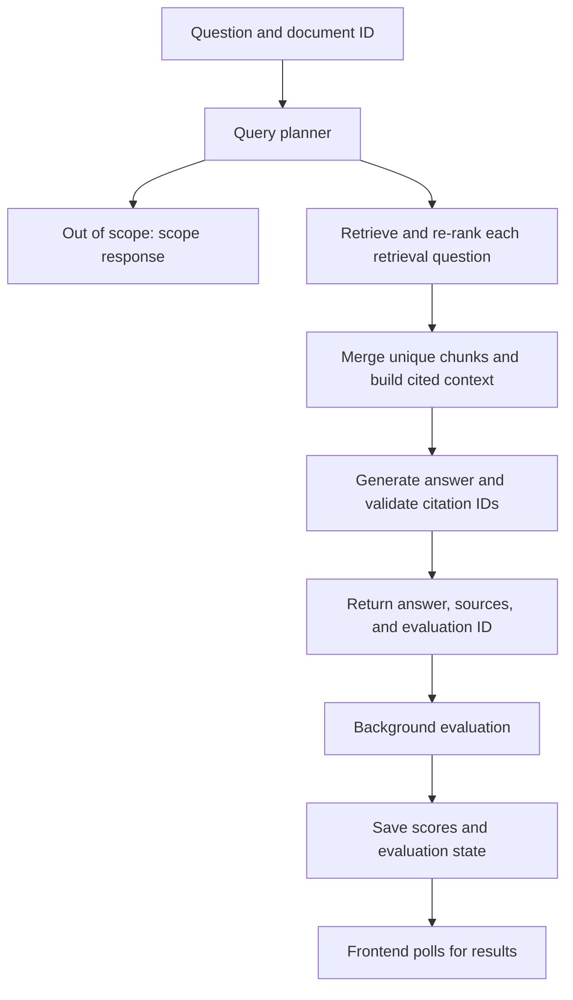

# HR Policy Bot

An HR handbook question-answering application built with Retrieval-Augmented Generation (RAG).

Users upload a PDF, prepare its search index, and ask questions about its contents. Answers include citations and expandable source excerpts. Evaluation runs in the background so users can read the answer while quality scores are being calculated.

## Features

- PDF upload with a configurable size limit, currently 10 MiB.
- PDF inspection using `pypdf`, including page counting and rejection of encrypted PDFs.
- UUID-based document storage with original filenames preserved for citations.
- Document metadata and evaluation states stored in SQLite.
- Text normalization and token-aware recursive chunking.
- Local embeddings and a separate FAISS index for each uploaded document.
- Query routing for single, multipart, and out-of-scope questions.
- Cross-encoder re-ranking of retrieved candidates.
- Structured answer generation through a LangChain LCEL chain.
- Citation ID validation and source resolution.
- Background RAGAS evaluation with frontend polling.
- LangSmith tracing and evaluation feedback.
- Detailed evaluation records in JSONL.
- A Next.js interface with a dark theme.

## Technology

| Component | Technology |
|---|---|
| Backend | Python, FastAPI |
| Data validation | Pydantic |
| Python environment | uv |
| Frontend | Next.js, React, TypeScript |
| PDF extraction | pypdf |
| Chunking | LangChain text splitters |
| Embeddings | Sentence Transformers |
| Vector search | FAISS |
| Re-ranking | Sentence Transformers CrossEncoder |
| Planning and generation | OpenAI through LangChain |
| Evaluation | RAGAS |
| Observability | LangSmith |
| Metadata and evaluation state | SQLite |

Current models:

- Embeddings: `sentence-transformers/all-MiniLM-L6-v2`
- Re-ranking: `cross-encoder/ms-marco-MiniLM-L6-v2`
- Query planning, answer generation, and evaluation: `gpt-4.1-mini`

Embedding model revisions are recorded in each index manifest. Query embeddings must use a compatible model and revision; matching vector dimensions alone is insufficient.

## How it works

### Document preparation

1. The browser uploads a PDF using `multipart/form-data`.
2. FastAPI checks the file size and opens it with `pypdf`.
3. The PDF is saved under a generated document ID.
4. Its original filename, page count, size, and status are stored in SQLite.
5. Ingestion extracts page text and preserves source metadata.
6. Text is normalized, split into chunks, and checked against the embedding model’s token limit.
7. Embeddings, a FAISS index, chunk records, and a manifest are saved.
8. The saved retrieval assets are loaded and validated before the document is marked `ready`.

### Question answering



For each retrieval question, the current workflow retrieves up to 20 candidates and keeps up to 3 after re-ranking. Results from decomposed questions are merged and deduplicated before generation.

### Retrieval and citations

FAISS uses `IndexFlatIP` with L2-normalized vectors, making inner-product scores equivalent to cosine similarity.

Each chunk retains:

- Original source filename.
- One-based PDF page number.
- Chunk number within that page.
- Extracted text.

Citation IDs such as `[S1]` are assigned to the context for an individual question. They are not permanent document identifiers.

Citation validation checks that referenced IDs exist and that inline citations agree with the structured source list. It does not independently prove that every cited passage supports its associated claim.

## Local setup

### Prerequisites

- Python compatible with `pyproject.toml`.
- uv.
- Node.js compatible with the installed Next.js version, and npm.
- An OpenAI API key with available API credit.
- A LangSmith account and API key to use tracing and feedback.

Run backend commands from the project root.

### 1. Install Python dependencies

```bash
uv sync
```

Use the repository’s dependency declarations and lockfile to reproduce its environment.

### 2. Configure environment variables

Create `.env` in the project root:

```dotenv
OPENAI_API_KEY=your_openai_api_key

LANGSMITH_TRACING=true
LANGSMITH_API_KEY=your_langsmith_api_key
LANGSMITH_PROJECT=policypal-dev
```

Optionally add a Hugging Face token:

```dotenv
HF_TOKEN=your_huggingface_token
```

Without LangSmith credentials, set `LANGSMITH_TRACING=false`.

Keep `.env` and API keys out of version control and frontend code.

### 3. Prepare the default handbook index

The current API startup loads a default index from `INDEX_DIR`. It must exist before the server starts, even though the application also supports uploaded documents.

Check these settings in `backend/config.py`:

- `HANDBOOK_PDF`
- `INDEX_DIR`
- `UPLOAD_DIR`
- `DATABASE_DIR`
- `CHUNK_SIZE`
- `CHUNK_OVERLAP`
- `MAX_UPLOAD_BYTES`

Place the initial handbook at `HANDBOOK_PDF`, then run:

```bash
uv run --env-file .env python -c "from backend.ingestion import build_index; build_index()"
```

Skip this step when valid default retrieval assets already exist.

The model loader may download model files from Hugging Face. Embedding computation runs locally.

### 4. Start FastAPI

If the API module is `backend/api.py`:

```bash
uv run --env-file .env uvicorn backend.api:app --reload
```

Adjust the module path if `api.py` is located elsewhere in your checkout.

Open:

- Health endpoint: http://127.0.0.1:8000/health
- Interactive API documentation: http://127.0.0.1:8000/docs

### 5. Start Next.js

In another terminal:

```bash
cd frontend
npm install
npm run dev
```

Open the URL printed by Next.js, normally:

http://localhost:3000

The current frontend calls `http://127.0.0.1:8000` directly. FastAPI allows the local frontend origins on port 3000. Update those addresses and CORS settings when deploying.

## Using the application

1. Select an HR-policy PDF.
2. Click **Upload and prepare**.
3. Wait until the document is shown as ready.
4. Enter a question and click **Ask**.
5. Read the answer and expand its source excerpts.
6. Wait for background evaluation scores to appear.

Example question:

> How can an employee review their personnel record, and what is the annual leave policy?

The interface requires a prepared document. The backend retains a default-handbook fallback for API requests that omit `document_id`.

## API endpoints

| Method | Endpoint | Purpose |
|---|---|---|
| GET | `/health` | Check that the API responds |
| POST | `/documents` | Upload and register a PDF |
| POST | `/documents/{document_id}/ingest` | Build or validate retrieval assets and mark the document ready |
| POST | `/questions` | Generate an answer using the selected document |
| GET | `/evaluations/{evaluation_id}` | Read evaluation status and scores |

### Upload a document

Send `multipart/form-data` with a file field named `file`.

A successful upload returns HTTP 201:

```json
{
  "filename": "handbook.pdf",
  "content_type": "application/pdf",
  "page_count": 43,
  "document_id": "9bc39ef3-50c3-49a2-b5c0-2154553bc93d",
  "size_bytes": 630797,
  "status": "uploaded"
}
```

Call the ingestion endpoint for that ID before asking questions.

### Ask a question

```json
{
  "question": "How can an employee review their personnel record?",
  "document_id": "9bc39ef3-50c3-49a2-b5c0-2154553bc93d"
}
```

The response includes:

- `answer`
- `sources`
- `evaluation_id`
- `evaluation_status`
- `scores`
- `trace_id`

For an answer awaiting evaluation, `evaluation_status` is `pending` and `scores` is `null`. Poll the evaluation endpoint for updates.

### Evaluation states

| Status | Meaning |
|---|---|
| `pending` | Evaluation has not finished |
| `completed` | All three scores are available |
| `skipped` | Evaluation was not applicable |
| `failed` | Evaluation could not complete |

Skipped and failed states include a reason and no scores. An evaluation failure does not remove the generated answer.

## Evaluation and observability

| Metric | What it measures |
|---|---|
| Faithfulness | Support for answer claims in the retrieved context |
| Answer relevancy | How closely the answer addresses the question |
| Context precision | Whether useful contexts occur early in the supplied ordering |

Context precision uses `ContextPrecisionWithoutReference` with the customized prompt version `useful_context_v1`. The prompt allows a chunk to contribute evidence for part of a multipart answer; a chunk does not need to support the entire answer.

These are model-assisted judgments. A score of `1.0` is not a guarantee of correctness, completeness, or citation accuracy. Results from the customized context-precision prompt should be identified separately from results using the default prompt.

The application records results in three places for different purposes:

- **SQLite:** evaluation state lookup for frontend polling.
- **JSONL:** detailed question, answer, context, score, and evaluator records.
- **LangSmith:** traces, timing information, and evaluation feedback.

LangSmith token and cost totals cover instrumented calls. They should not be assumed to include every evaluator call.

## Storage

Paths are configured in `backend/config.py`.

| Location | Contents |
|---|---|
| `UPLOAD_DIR/{document_id}.pdf` | Original uploaded PDF |
| `INDEX_DIR` | Default handbook retrieval assets |
| `INDEX_DIR.parent/{document_id}/` | Uploaded document retrieval assets |
| `DATABASE_DIR/evaluations.sqlite3` | Document records and evaluation states |
| `backend/logs/evaluations.jsonl` | Detailed evaluation records in the current helper implementation |

Each index directory contains:

- `index.faiss`
- `chunks.jsonl`
- `manifest.json`

The index depends on chunk ordering and the embedding configuration in its manifest. Keep these files together.

Documents are cached in memory when first queried. Cached resources are process-local and are reloaded after a restart.

### Inspect a document record

If `backend/inspect_document_store.py` is included in the checkout:

```bash
uv run -m backend.inspect_document_store YOUR_DOCUMENT_UUID
```

The script opens the database read-only and validates the stored metadata with Pydantic.

## Validation status

The following workflows have been manually exercised during development:

- PDF inspection, upload, and document registration.
- Extraction with original filenames preserved.
- Building and loading per-document retrieval assets.
- Question answering with citations.
- Query decomposition and re-ranking.
- Background evaluation and status polling.
- Browser upload, preparation, and question answering.

A development run on the 43-page Bennett College handbook produced:

| Property | Observed value |
|---|---|
| Chunks | 152 |
| Embedding dimensions | 384 |
| Largest final chunk | 202 tokens |
| Oversized final chunks | 0 |

These are pipeline observations, not a general quality benchmark.

Pending validation includes:

- Isolation between two documents containing different policy facts.
- Representative supported, unsupported, and multipart questions.
- Manual checks of claim support and citation accuracy.
- Before/after re-ranking comparison.
- Failure and restart behavior.
- Hosted end-to-end verification.

## Current limitations

- Deployment is not yet complete.
- Encrypted PDFs are rejected.
- OCR is not implemented; image-only PDFs may not yield usable text.
- Extraction can imperfectly preserve tables, spacing, and reading order.
- Chunks are created per page; overlap does not cross page boundaries.
- New-document ingestion runs during the HTTP request.
- Background evaluation runs inside the API process and is not a durable job queue.
- Interrupted evaluations can remain pending; restart recovery is pending.
- Frontend requests do not yet have explicit timeouts.
- Retrying failed preparation through the current UI creates another upload.
- Runtime validation of frontend JSON responses is partial.
- Document resource caches have no eviction policy.
- UUID document IDs do not provide authorization or user isolation.
- File-size checking occurs after multipart reception; hosting-level request limits remain to be configured.
- Existing incomplete index directories require repair before ingestion can proceed.
